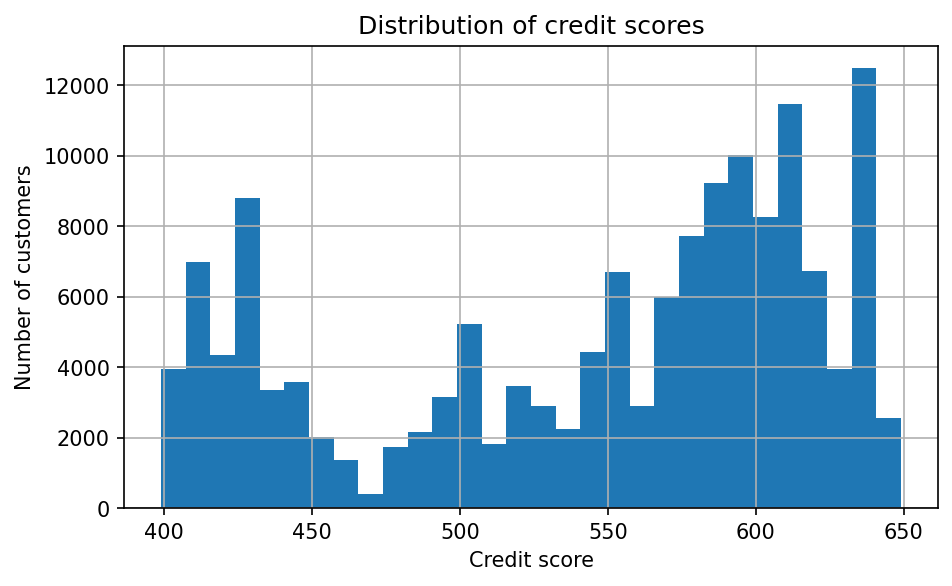
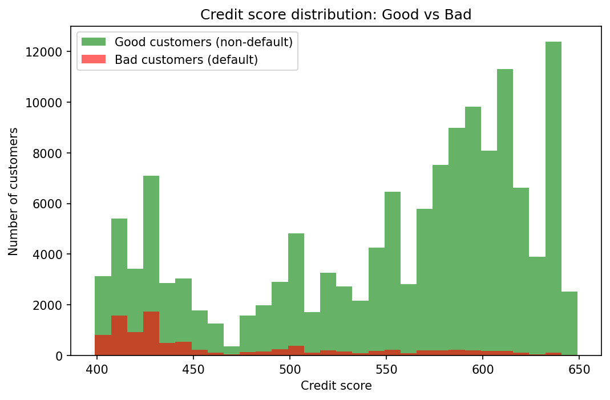

# Credit Risk Scorecard

This project builds a credit risk scorecard model to estimate the probability that a customer will default within two years.  
The scorecard approach is widely used in banking because it provides both a probability of default (PD) and an interpretable credit score.

The project uses the **Give Me Some Credit** dataset (from Kaggle) and follows a structured, step-by-step roadmap from raw data to a working scorecard model.


## Environment Setup

It is recommended to use a virtual environment to keep dependencies clean and avoid conflicts with other Python projects.

### 1. Create a virtual environment
python -m venv venv
### 2. Activate the virtual environment
- On Windows:
```
venv\Scripts\activate
```
- On Mac/Linux::
```
source venv/bin/activate
``` 
### 3. Install required packages
```
pip install -r requirements.txt
```
### 4. Launch Jupyter Notebook
```
jupyter notebook
```
## Installation
If you already have a Python environment set up, you can install the dependencies directly:
```
pip install -r requirements.txt
```
Then open the Jupyter notebook located in the notebooks/ folder to run the project.

---

## Project Roadmap
### Stage 1: Setup & Data Load
- Loaded the raw dataset (`cs-training.csv`) into Python (pandas).
- Saved a clean version into an SQLite database for analysis.
- Ran basic checks: number of rows, columns, and summary statistics.

### Stage 2: SQL-based Exploratory Data Analysis
- Used SQL queries to explore data directly in SQLite.
- Checked default rate, age distribution, and utilization outliers.
- Reviewed missing values (e.g., `MonthlyIncome`, `NumberOfDependents`).

### Stage 3: Data Cleaning & Feature Engineering
- Handled missing values by imputation (e.g., median income).
- Addressed outliers (e.g., utilization capped at 1.0, age minimum set to 18).
- Created binned variables for **age, income, utilization**.
- Calculated **Weight of Evidence (WoE)** and **Information Value (IV)**.

### Stage 4: Scorecard Model
- Trained a logistic regression model using WoE features (age, income, utilization).
- Converted model coefficients into a scorecard with points assigned to each variable bin.
- Calculated customer-level credit scores by adding up base points and feature points.
- Visualized the score distribution to check how well the scorecard separates good and bad customers.

---

## Repository Structure

- `data/` → raw dataset (excluded if large, see `.gitignore`)
- `notebooks/` → Jupyter notebooks with full workflow
- `sql/` → SQL queries and supporting notes
  - `eda_queries.sql` → exploratory SQL queries
  - `schema_and_load_notes.md` → how the SQL table was created in Python
- `reports/` → charts and outputs
- `requirements.txt` → Python dependencies
- `.gitignore` → files excluded from version control
- `README.md` → project summary


---

## Results

- Built an interpretable credit risk scorecard.  
- Demonstrated how customer characteristics (age, income, utilization) affect default probability.  
- Produced a scoring system aligned with banking practices (base score, points to double odds).  
- Validated the model: good customers scored higher on average, and applying a cutoff (600) clearly separated approved vs rejected customers, with much lower default rates in the approved group.


---

## Visualisations

**1) Credit score distribution across all customers:**

  


**2) Credit score distribution split between good vs bad customers:** 

  

---

## License

This project is for **educational purposes** and not intended for production use in real credit risk modelling.
